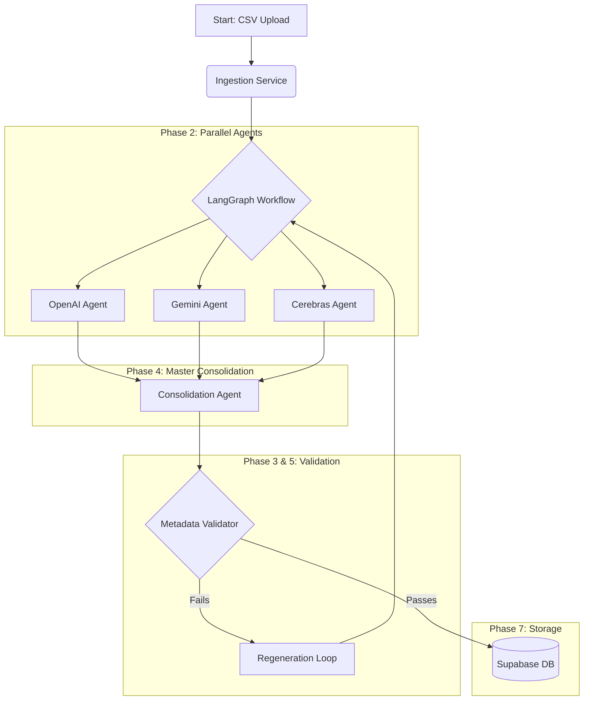

# Enterprise AI Company Intelligence Platform Walkthrough

## 1. System Architecture

The system follows a multi-agent architecture powered by LangGraph, allowing parallel processing across three distinct Large Language Models.

### LangGraph Workflow Visualization



## 2. Testing Examples (API Usage)

You can interact with the system entirely through the REST API. Below are examples of how to interact with it.

### 2.1 Uploading Data
To upload a CSV file and trigger the parallel agent workflow:

```bash
curl -X POST "http://localhost:8000/api/v1/upload/" \
  -H "accept: application/json" \
  -H "Content-Type: multipart/form-data" \
  -F "file=@sample_companies.csv"
```

**Expected Response:**
```json
{
  "status": "success",
  "message": "Successfully received 5 records for processing.",
  "job_status": "queued"
}
```

### 2.2 Fetching Company Intelligence
To get the fully consolidated profile of a specific company (which includes scores, culture, and risk analysis):

```bash
curl -X GET "http://localhost:8000/api/v1/companies/{company_id}" \
  -H "accept: application/json"
```

**Expected Response:**
```json
{
  "company": {
    "id": "e4f8d224-...",
    "company_name": "Acme Corp",
    "industry": "Software",
    "positioning": "Market leader in cloud infrastructure with a focus on scalable enterprise solutions.",
    "tam_sam_som": "TAM: $50B, SAM: $15B, SOM: $1.5B"
  },
  "scores": {
    "innovation_score": 92.5,
    "risk_score": 15.0,
    "confidence_score": 98.2
  }
}
```

## 3. Local Setup & Execution

Since you are on Windows, we've provided a simple `setup.ps1` script to automate dependency installation.

1. **Install Dependencies:**
   Run `.\setup.ps1` from the root directory.
   
2. **Setup Supabase:**
   Navigate to the Supabase web dashboard, open the SQL Editor, and paste the contents of `backend/database/schema.sql` to generate all your tables.

3. **Start the System:**
   - **Backend:** `cd backend; uvicorn main:app --reload`
   - **Frontend:** `cd frontend; npm run dev`

Navigate to `http://localhost:5173` to see your stunning, glassmorphic React dashboard in action!
